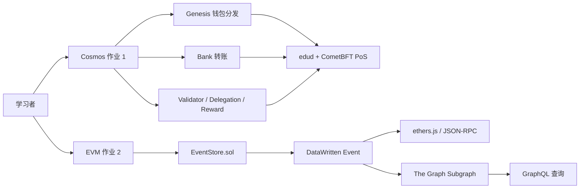

<div align="center">

# ⛓️ Blockchain Homework Lab

### 从零搭建一条 Cosmos 应用链，并完成 EVM 日志索引实验

一个面向 Web3 初学者的双轨实训项目：
**Cosmos SDK 自定义链** + **Hardhat / ethers.js / The Graph 数据读取**。

<p>
  
  
  
  
  
</p>

<p>
  <a href="#-项目目标">项目目标</a> ·
  <a href="#-快速开始">快速开始</a> ·
  <a href="#-目录结构">目录结构</a> ·
  <a href="#-验收状态">验收状态</a>
</p>

</div>

## ✨ 项目目标

本项目将两份作业拆成两个相互独立、可以分别运行的实验线：

| 实验线 | 重点问题 | 产出 |
| --- | --- | --- |
| **作业 1 · Cosmos** | 如何拥有一条自己的应用链？钱包如何分发、转账和参与共识？ | `edu` 链、`edud` 节点、Genesis 分发、Bank 转账、PoS 验证者 / 委托 / 奖励演示 |
| **作业 2 · EVM** | 如何通过 RPC、ethers.js 和事件索引读取链上数据？ | `EventStore` 合约、RPC 读取脚本、Infura / Alchemy 对比、The Graph Subgraph |

> Cosmos 线中的“挖矿”准确来说是 **PoS 验证者出块、质押、委托与奖励**，不是 PoW 算力挖矿。

## 🧭 架构总览



## 📁 目录结构

```text
blockchain-homework/
├── cosmos-chain/                 # 作业 1：Cosmos SDK 自定义链
│   ├── app/                       # 链应用与模块装配
│   ├── cmd/edud/                  # 节点 CLI
│   ├── config.yml                 # 本地 Genesis / 账户分发配置
│   ├── scripts/demo.sh            # 钱包、余额、转账、质押演示
│   └── README.md                  # Cosmos 学习手册
├── evm-event-lab/                 # 作业 2：EVM 链上数据读取
│   ├── contracts/EventStore.sol   # 事件写入合约
│   ├── scripts/                   # 部署、RPC、写入、日志读取脚本
│   ├── test/                      # Solidity / Hardhat 测试
│   └── subgraph/                  # schema、mapping、GraphQL 查询
├── docs/                          # 需求、架构、验收、变更记录
└── Makefile                       # 两条实验线的统一检查入口
```

## 🚀 快速开始

### 环境要求

- Go 1.24+
- Node.js 20+
- npm 10+
- Ignite CLI v29（运行 Cosmos 节点时需要）

### 1. 获取项目并查看命令

```bash
git clone <your-repository-url>
cd blockchain-homework
make help
```

### 2. 运行 Cosmos 作业

```bash
cd cosmos-chain

# 启动本地学习链
ignite chain serve
```

另开终端执行演示：

```bash
cd cosmos-chain
./scripts/demo.sh
```

演示脚本默认只读查询，不会重置本地链，也不会输出私钥。需要执行转账时，再显式设置：

```bash
DEMO_SEND=1 ./scripts/demo.sh
```

完整说明见 [Cosmos 作业手册](cosmos-chain/README.md)。

### 3. 运行 EVM / ethers.js 作业

```bash
cd evm-event-lab
npm install
npm run graph:install
cp .env.example .env

# 编译与测试
npm run compile
npm test
```

启动本地节点并部署合约：

```bash
# 终端 A
npm run node

# 终端 B
npm run deploy:local
```

然后将部署地址写入本地 `.env` 的 `EVENT_STORE_ADDRESS`，执行事件写入和读取：

```bash
npm run write:local
npm run read:events
```

完整说明见 [EVM / The Graph 作业手册](evm-event-lab/README.md)。

## 🔍 作业 2 的三种日志读取方式

`EventStore.writeData(key, value)` 不把业务数据写入 Solidity storage，而是发出 `DataWritten` 事件。

```solidity
event DataWritten(
    address indexed writer,
    bytes32 indexed keyHash,
    string key,
    string value,
    uint256 timestamp
);
```

同一条日志可以通过三层方式读取：

1. **JSON-RPC**：`provider.getLogs`，理解底层日志过滤。
2. **ethers.js**：`contract.queryFilter`，理解合约事件封装。
3. **The Graph**：Subgraph mapping 将事件转换成实体，再通过 GraphQL 查询。

## ✅ 验收状态

| 检查项 | 状态 | 说明 |
| --- | :---: | --- |
| Cosmos `edud` 构建 | ✅ | 节点 CLI 可运行 |
| Cosmos Go 测试 | ✅ | `go test ./...` 通过 |
| EVM 合约编译 | ✅ | `EventStore.sol` 编译通过 |
| Hardhat 测试 | ✅ | `2 passing` |
| 本地 EVM 部署 / 写入 / 读取 | ✅ | 已验证 RPC、`queryFilter`、Receipt |
| The Graph codegen / build | ✅ | Subgraph 构建通过 |
| Sepolia 部署 | ⏳ | 需要本地测试钱包与 RPC 配置 |
| Infura / Alchemy 实际读取 | ⏳ | 需要本地配置两个 RPC URL |
| The Graph Studio 发布 | ⏳ | 需要真实合约地址、起始区块和部署凭证 |

统一执行本地检查：

```bash
make check
```

## 📚 文档导航

- [需求说明](docs/requirements.md)
- [总体架构](docs/architecture.md)
- [验收标准](docs/acceptance.md)
- [变更记录](docs/CHANGELOG-2026-08-12.md)

## 🔐 安全边界

- `.env`、私钥、助记词、API Key 不进入仓库。
- 测试网钱包必须与真实资产钱包隔离。
- README 只记录已验证的本地结果；真实测试网部署必须补充合约地址、交易哈希、区块号和浏览器链接。
- 当前依赖审计没有 critical 级别问题，但仍可能存在开发工具链告警；不要使用破坏当前版本兼容性的强制升级清理告警。

## 🗺️ 后续学习路线

1. 启动 Cosmos 本地链，记录 Alice / Bob / Validator 地址和余额变化。
2. 完成一笔 Bank 转账，再完成 validator 委托与奖励查询。
3. 使用测试钱包部署 `EventStore` 到 Sepolia。
4. 用 Infura 和 Alchemy 读取同一合约的区块与事件。
5. 将真实地址和起始区块写入 Subgraph，发布到 The Graph Studio，并完成 GraphQL 查询。

---

<div align="center">

Made for learning Web3 by building the chain and the data path end to end.

</div>
