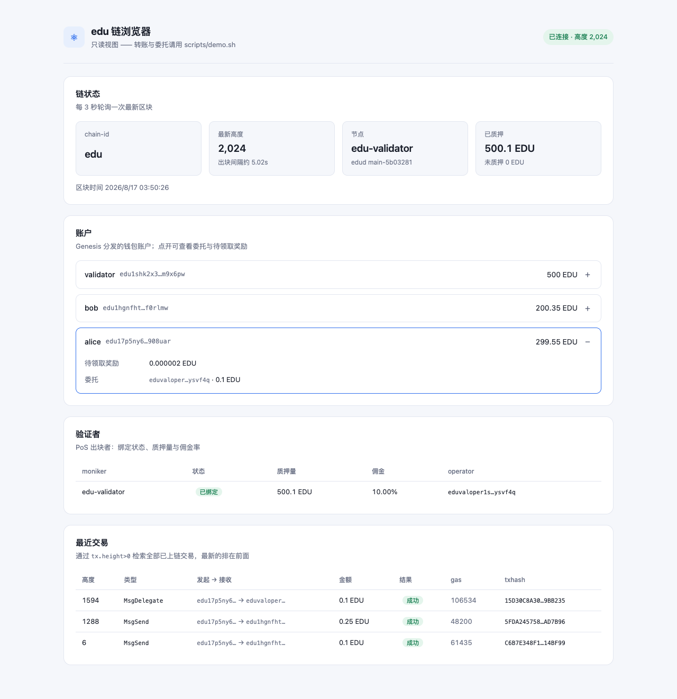
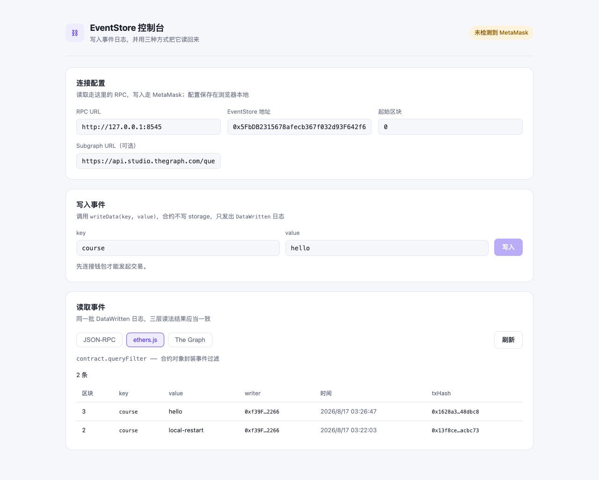
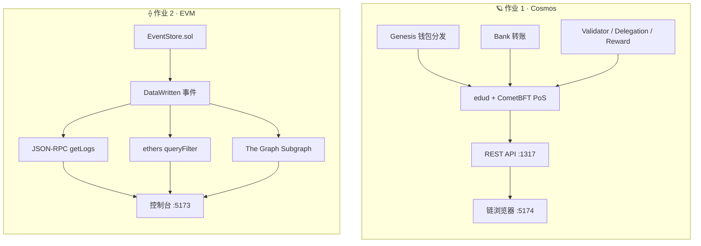

<div align="center">

<br />

# ⛓️ Blockchain Homework Lab

**从零搭建一条 Cosmos 应用链，并完成 EVM 日志索引实验**

面向 Web3 初学者的双轨实训项目 —— 一条自己的应用链，一条链上数据读取的完整路径。

<br />

<p>
  
  
  
  
  
  
</p>

<p>
  
  
  
</p>

<p>
  <a href="#-两条实验线">实验线</a> ·
  <a href="#-界面预览">界面预览</a> ·
  <a href="#-快速开始">快速开始</a> ·
  <a href="#-线上产物">线上产物</a> ·
  <a href="#-验收状态">验收状态</a>
</p>

<br />

</div>

---

## 🎯 两条实验线

两份作业拆成两条相互独立、可分别运行的实验线。

<table>
<tr>
<th width="50%">🪐 作业 1 · Cosmos 应用链</th>
<th width="50%">⟠ 作业 2 · EVM 数据读取</th>
</tr>
<tr>
<td valign="top">

**要回答的问题**

如何拥有一条自己的链？钱包怎么分发、转账、参与共识？

**产出**

- `edu` 链 + `edud` 节点二进制
- Genesis 三账户分发（alice / bob / validator）
- Bank 转账
- PoS 验证者、委托、奖励
- 只读链浏览器（React）

</td>
<td valign="top">

**要回答的问题**

如何通过 RPC、ethers.js 和事件索引读取链上数据？

**产出**

- `EventStore` 合约（只写事件，不写 storage）
- 三种日志读取方式
- Infura / Alchemy 对比
- The Graph Subgraph
- MetaMask 交互控制台（React）

</td>
</tr>
</table>

> [!NOTE]
> Cosmos 线中的「挖矿」准确说是 **PoS 验证者出块、质押、委托与奖励**，不是 PoW 算力挖矿。

<br />

## 🖼️ 界面预览

<table>
<tr>
<td width="50%" align="center"><b>edu 链浏览器</b><br /><sub>区块 · 余额 · 验证者 · 委托奖励 · 交易</sub></td>
<td width="50%" align="center"><b>EventStore 控制台</b><br /><sub>MetaMask 写入 · 三种读取方式对照</sub></td>
</tr>
<tr>
<td></td>
<td></td>
</tr>
</table>

<br />

## 🧭 架构总览



<br />

## 🚀 快速开始

### 环境要求

| 依赖 | 版本 | 说明 |
| --- | --- | --- |
| Go | 1.24+ | 构建 `edud` 节点 |
| Node.js | 20+ | EVM 线与两个前端 |
| npm | 10+ | — |
| Ignite CLI | v29 | **可选**，见下方说明 |

```bash
git clone <your-repository-url>
cd blockchain-homework
make help
```

<br />

### 🪐 作业 1 · Cosmos

<details open>
<summary><b>启动本地链</b></summary>

<br />

装了 Ignite CLI 的话最简单：

```bash
cd cosmos-chain
ignite chain serve
```

没装 Ignite 也能跑 —— 用 `edud` 手动引导一次即可（只需做一次）：

```bash
cd cosmos-chain
make build

./build/edud init edu-validator --chain-id edu --default-denom uedu
for k in alice bob validator; do ./build/edud keys add $k --keyring-backend test; done

./build/edud genesis add-genesis-account alice     300000000uedu  --keyring-backend test
./build/edud genesis add-genesis-account bob       200000000uedu  --keyring-backend test
./build/edud genesis add-genesis-account validator 1000000000uedu --keyring-backend test

./build/edud genesis gentx validator 500000000uedu \
  --chain-id edu --keyring-backend test --moniker edu-validator
./build/edud genesis collect-gentxs
./build/edud genesis validate-genesis

./build/edud start --minimum-gas-prices 0uedu
```

金额与 [config.yml](cosmos-chain/config.yml) 保持一致。手动方式没有 faucet，其余（账户、质押、出块）与 Ignite 一致。

</details>

<details>
<summary><b>转账、委托与奖励</b></summary>

<br />

演示脚本默认只读，不会重置链，也不输出私钥：

```bash
cd cosmos-chain
./scripts/demo.sh
```

需要发交易时显式开启：

```bash
DEMO_SEND=1 ./scripts/demo.sh
```

手动委托（注意目标是 `eduvaloper` 前缀的 operator 地址，不是账户地址）：

```bash
./build/edud tx staking delegate <eduvaloper地址> 100000uedu \
  --from alice --keyring-backend test --chain-id edu \
  --node http://127.0.0.1:26657 --yes
```

完整说明见 [Cosmos 作业手册](cosmos-chain/README.md)。

</details>

<details>
<summary><b>启动链浏览器</b></summary>

<br />

```bash
cd cosmos-chain/frontend
npm install
cp .env.example .env
npm run dev
```

打开 **http://localhost:5174/** 。需要节点开启 REST API（`app.toml` 中 `[api] enable = true`，`ignite chain serve` 默认已开）。

页面只读 —— 发交易仍走 CLI，页面在下次轮询时自动反映变化。详见 [链浏览器手册](cosmos-chain/frontend/README.md)。

</details>

<br />

### ⟠ 作业 2 · EVM

<details open>
<summary><b>安装、编译与测试</b></summary>

<br />

```bash
cd evm-event-lab
npm install
npm run graph:install
cp .env.example .env

npm run compile
npm test
```

</details>

<details>
<summary><b>本地链部署与读写</b></summary>

<br />

```bash
# 终端 A
npm run node

# 终端 B
npm run deploy:local
```

把输出的地址写入 `.env` 的 `LOCAL_EVENT_STORE_ADDRESS`，然后：

```bash
npm run write:local
npm run read:events
```

</details>

<details>
<summary><b>Sepolia 测试网</b></summary>

<br />

在 `.env` 填好 `SEPOLIA_RPC_URL` 和 `DEPLOYER_PRIVATE_KEY`（测试钱包，与真实资产隔离）：

```bash
npm run deploy:sepolia
npm run write:sepolia
npm run read:events:sepolia
npm run compare:providers
```

本地与 Sepolia 使用**各自独立的环境变量**，互不覆盖：

| 用途 | 本地 | Sepolia |
| --- | --- | --- |
| RPC | `LOCAL_RPC_URL` | `SEPOLIA_RPC_URL` |
| 合约地址 | `LOCAL_EVENT_STORE_ADDRESS` | `SEPOLIA_EVENT_STORE_ADDRESS` |
| 起始区块 | `LOCAL_FROM_BLOCK` | `SEPOLIA_FROM_BLOCK` |

Hardhat 脚本按 `--network` 自动选择，纯 node 脚本用 `NETWORK=sepolia` 或 `:sepolia` 后缀的 npm 脚本。

</details>

<details>
<summary><b>启动前端控制台</b></summary>

<br />

```bash
cd evm-event-lab/frontend
npm install
cp .env.example .env   # 填入 VITE_EVENT_STORE_ADDRESS
npm run dev
```

打开 **http://localhost:5173/** 。详见 [控制台手册](evm-event-lab/frontend/README.md)。

</details>

> [!TIP]
> 两个前端都用 Vite 8，**只监听 `localhost`** —— 用 `127.0.0.1:5173` 会连不上。

<br />

### 🔌 端口一览

| 端口 | 服务 | 所属 |
| :---: | --- | --- |
| `26657` | CometBFT RPC | 作业 1 |
| `1317` | Cosmos REST API / Swagger | 作业 1 |
| `5174` | 链浏览器 | 作业 1 |
| `8545` | Hardhat JSON-RPC | 作业 2 |
| `5173` | EventStore 控制台 | 作业 2 |

<br />

## 🔍 作业 2 的三种日志读取方式

`EventStore.writeData(key, value)` 不把业务数据写进 storage，而是发出事件：

```solidity
event DataWritten(
    address indexed writer,
    bytes32 indexed keyHash,
    string key,
    string value,
    uint256 timestamp
);
```

同一条日志有三层读法，抽象程度递增：

| # | 方式 | 调用 | 关注点 |
| :---: | --- | --- | --- |
| 1 | **JSON-RPC** | `provider.getLogs` | 手工拼 topics、自己解码，理解底层过滤 |
| 2 | **ethers.js** | `contract.queryFilter` | 合约对象封装事件，自动解码 |
| 3 | **The Graph** | GraphQL `dataWrittens` | mapping 预先索引成实体，支持排序 / 过滤 / 分页 |

前两种每次查询都要 RPC 节点**现场扫描区块范围**，范围大时慢且可能被限流；The Graph 查的是**已建好索引的数据库**，代价是需要额外部署与等待同步。

前端控制台把三种方式做成三个 tab，读同一批日志、渲染同一张表，可直接对照。

<br />

## 🌐 线上产物

作业 2 已完成真实测试网部署，全部可独立复核。

| 项 | 值 |
| --- | --- |
| **合约** | [`0x275Bb3520c05eaed91c552c8FDceE09aA43a5775`](https://sepolia.etherscan.io/address/0x275Bb3520c05eaed91c552c8FDceE09aA43a5775) |
| **部署交易** | [`0xf3aed655…8676ec9f`](https://sepolia.etherscan.io/tx/0xf3aed6558e6b1e3c4b5b7b032ad98f2b9b0c832e73bd46fbde0d620c8676ec9f) · 区块 `11507193` |
| **事件写入** | [`0xfa127e3e…67e9aa22`](https://sepolia.etherscan.io/tx/0xfa127e3e24808a9110cfba2567ab8ae6be7cc4e863dd0e83e0e4ff7867e9aa22) · 区块 `11507198` |
| **Subgraph** | `mychain` v0.0.1 · [Studio](https://thegraph.com/studio/subgraph/mychain) |
| **查询端点** | `https://api.studio.thegraph.com/query/1757875/mychain/v0.0.1` |

完整证据（gasUsed、topic0、解码字段、provider 对比、GraphQL 返回）见 [Sepolia 部署记录](docs/sepolia-deployment.md)。

<br />

## ✅ 验收状态

<table>
<tr><th>检查项</th><th align="center">状态</th><th>说明</th></tr>
<tr><td colspan="3"><b>🪐 作业 1 · Cosmos</b></td></tr>
<tr><td><code>edud</code> 构建</td><td align="center">✅</td><td>节点 CLI 可运行</td></tr>
<tr><td>Go 测试</td><td align="center">✅</td><td><code>go test ./...</code> 通过</td></tr>
<tr><td>Genesis 分发与转账</td><td align="center">✅</td><td>三账户余额可查，Bank 转账已核对</td></tr>
<tr><td>验证者 / 委托 / 奖励</td><td align="center">✅</td><td>alice 委托 0.1 EDU，奖励逐块累积</td></tr>
<tr><td>链浏览器</td><td align="center">✅</td><td>区块、余额、验证者、委托奖励、交易与自动刷新</td></tr>
<tr><td colspan="3"><b>⟠ 作业 2 · EVM</b></td></tr>
<tr><td>合约编译</td><td align="center">✅</td><td><code>EventStore.sol</code> 编译通过</td></tr>
<tr><td>Hardhat 测试</td><td align="center">✅</td><td><code>2 passing</code></td></tr>
<tr><td>本地部署 / 写入 / 读取</td><td align="center">✅</td><td>已验证 RPC、<code>queryFilter</code>、Receipt</td></tr>
<tr><td>Sepolia 部署</td><td align="center">✅</td><td><code>0x275Bb352…3a5775</code>，区块 11507193</td></tr>
<tr><td>Sepolia 事件写入 / 读取</td><td align="center">✅</td><td>区块 11507198，两种读法均已读回</td></tr>
<tr><td>Infura / Alchemy 对比</td><td align="center">✅</td><td>结果一致，已记录延迟差异</td></tr>
<tr><td>Subgraph codegen / build</td><td align="center">✅</td><td>manifest 已指向真实合约</td></tr>
<tr><td>The Graph Studio 发布</td><td align="center">✅</td><td><code>mychain</code> v0.0.1，GraphQL 返回真实数据</td></tr>
<tr><td>前端控制台</td><td align="center">✅</td><td>连接配置、三种读取方式、实时订阅</td></tr>
</table>

统一执行本地检查：

```bash
make check
```

<br />

## 📁 目录结构

```text
blockchain-homework/
├── cosmos-chain/                    # 🪐 作业 1：Cosmos SDK 自定义链
│   ├── app/                         #    链应用与模块装配
│   ├── cmd/edud/                    #    节点 CLI
│   ├── config.yml                   #    Genesis / 账户分发配置
│   ├── scripts/demo.sh              #    钱包、余额、转账、质押演示
│   ├── frontend/                    #    只读链浏览器（React + Vite）
│   └── README.md                    #    Cosmos 学习手册
│
├── evm-event-lab/                   # ⟠ 作业 2：EVM 链上数据读取
│   ├── contracts/EventStore.sol     #    事件写入合约
│   ├── scripts/                     #    部署、RPC、写入、日志读取
│   │   └── lib/network.js           #    本地 / Sepolia 变量解析
│   ├── test/                        #    Hardhat 测试
│   ├── subgraph/                    #    schema、mapping、GraphQL 查询
│   ├── frontend/                    #    交互控制台（React + ethers v6）
│   └── README.md                    #    EVM / The Graph 手册
│
├── docs/                            # 需求、架构、验收、部署记录
└── Makefile                         # 两条线的统一检查入口
```

<br />

## 📚 文档导航

| 文档 | 内容 |
| --- | --- |
| [需求说明](docs/requirements.md) | 两条线的功能要求与技术基线 |
| [总体架构](docs/architecture.md) | 模块划分与数据流 |
| [验收标准](docs/acceptance.md) | 逐项检查清单 |
| [Sepolia 部署记录](docs/sepolia-deployment.md) | 可复核的链上证据 |
| [变更记录](docs/CHANGELOG-2026-08-12.md) | 历史变更 |

<br />

## 🔐 安全边界

> [!IMPORTANT]
> - `.env`、私钥、助记词、API Key、完整 RPC URL **一律不进仓库**，已由 `.gitignore` 排除。
> - 测试网钱包必须与真实资产钱包**完全隔离**。
> - 前端不接触私钥：EVM 交易由 MetaMask 签名，Cosmos 页面为纯只读。
> - `VITE_*` 变量会被**编译进前端 bundle**，因此含 API Key 的 RPC URL 不写入前端 `.env`，改在页面配置面板填写（只存 localStorage）。
> - 文档只记录已验证的结果；测试网部署必须附合约地址、交易哈希、区块号和浏览器链接。

<br />

## 🗺️ 继续深入

- [ ] 在 Etherscan 上验证合约源码，让事件日志显示为可读字段名
- [ ] 给链浏览器接入 Keplr，实现网页端转账与委托
- [ ] 用 `ignite generate openapi` 补全 Swagger 控制台（当前 `paths` 为空）
- [ ] 为 Subgraph 增加按 `keyHash` 聚合的实体，体会索引层的建模能力
- [ ] 把两个前端部署成静态站点，配好反向代理与 CORS

<br />

---

<div align="center">

<sub>Built for learning Web3 — the chain and the data path, end to end.</sub>

</div>
